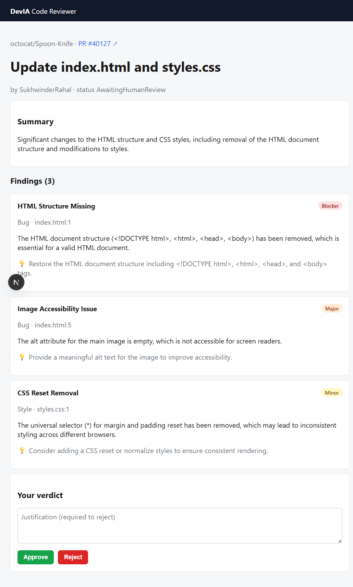

# DevIA Code Reviewer

[](https://github.com/cmscarpelini/devia-code-reviewer/actions/workflows/ci.yml)
[](LICENSE)


> AI-assisted code review for GitHub Pull Requests, with a **human in the loop**. The AI reads a
> PR's diff and produces an executive summary plus a severity-ranked list of findings; a Senior
> Developer makes the final call (approve / reject), and that decision is reflected back on GitHub.

**The AI prepares the decision; the human decides.**

```
PR opened on GitHub → webhook → queue → worker → AI pipeline → assessment
                                                        │
                                   Senior Dev approves/rejects (dashboard)
                                                        │
                                   reflected on the PR (Check Run + comment)
```

## Why this project is interesting

A compact but production-shaped system that tackles the hard parts of building on top of an LLM:

- **Clean Architecture** (Domain · Application · Infrastructure · Api/Worker) — business rules
  depend on nothing external; everything outside is pluggable.
- **Asynchronous pipeline** — the webhook only enqueues; a separate Worker consumes the queue and
  runs the review, with idempotency and a state machine (`Pending → Processing → AwaitingHumanReview`).
- **Provider-agnostic AI pipeline** (Semantic Kernel) — explicitly orchestrated (no autonomous
  agent), asks the model for **structured JSON**, validates it, and repairs once on bad output.
- **Polyglot persistence** — PostgreSQL for structured/queryable data, MongoDB for the heavy raw
  result (diff, prompts, raw model output); written Mongo-first for crash resilience.
- **A real evaluation harness** — the standout piece: measures the AI's quality (recall, precision,
  F1, false-positive rate, severity accuracy) over a labeled golden dataset, with an LLM-as-judge,
  multi-run variance, rate-limit resilience, and a result cache. See [`tests/DevIa.Evals`](tests/DevIa.Evals/README.md).
- **Tested**: ~85 unit tests + integration tests (Testcontainers spin up real Postgres / RabbitMQ /
  Mongo), the deterministic half of a two-part testing strategy.

## Dashboard

The reviewer-facing dashboard (Next.js + React + TypeScript) is where the human closes the loop:

- **Login** — sign in with GitHub (OAuth → JWT).
- **Review queue** — the PRs awaiting a human verdict, with repository, status, and risk.
- **Review detail** — the AI's executive summary and severity-ranked findings, with **Approve** /
  **Reject** actions; the verdict is reflected back on the PR (Check Run + comment).



## Architecture (layers)

| Layer | Responsibility |
|-------|----------------|
| **Domain** | Pure business rules — the `Review` aggregate, its state machine and invariants. Knows nothing about DBs, HTTP, or the LLM. |
| **Application** | Use cases + **ports** (interfaces): receive webhook, process review job, record verdict. |
| **Infrastructure** | **Adapters** for the ports: EF Core (Postgres), MongoDB, RabbitMQ, GitHub, Semantic Kernel. |
| **Api / Worker** | Entry points — the ASP.NET Core API (webhooks, auth, dashboard endpoints) and the queue-consuming Worker. |

Ports & adapters are what make the AI and GitHub *mockable*, so the whole flow is testable without
calling any external service.

## Stack

- **Backend:** .NET 10, ASP.NET Core, Semantic Kernel, Entity Framework Core
- **Frontend:** Next.js (App Router), React, TypeScript
- **Data:** PostgreSQL (relational) + MongoDB (review documents)
- **Messaging:** RabbitMQ
- **LLM:** pluggable provider — Azure OpenAI / OpenAI / GitHub Models / Ollama (chosen by config)

## Repository structure

| Path | Contents |
|------|----------|
| [`docs/`](docs/README.md) | Methodology, architecture (C4 + ADRs), domain (DDD), and feature specs |
| `src/DevIa.Domain` · `.Application` · `.Infrastructure` | Clean Architecture layers |
| `src/DevIa.Api/` | REST API: webhooks, auth (GitHub OAuth + JWT), review/repository endpoints |
| `src/DevIa.Worker/` | Worker: RabbitMQ consumer + the review pipeline |
| [`web/`](web/) | Dashboard (Next.js + React + TypeScript) |
| `tests/DevIa.UnitTests` · `.IntegrationTests` | Deterministic tests (LLM mocked) |
| [`tests/DevIa.Evals/`](tests/DevIa.Evals/README.md) | AI-quality eval harness + golden dataset |

## Getting started

### Prerequisites

- .NET 10 SDK
- Docker (for the local infra and the integration tests)
- Node.js (for the dashboard)

### 1. Start the local infrastructure

```bash
docker compose up -d --wait postgres mongo rabbitmq
```

### 2. Apply database migrations

```bash
dotnet ef database update --project src/DevIa.Infrastructure
```

### 3. Build & test

```bash
dotnet build DevIa.slnx
dotnet test tests/DevIa.UnitTests          # fast, no Docker
dotnet test tests/DevIa.IntegrationTests   # spins up Postgres/RabbitMQ/Mongo via Testcontainers
```

### 4. Run the API, Worker, and dashboard

```bash
dotnet run --project src/DevIa.Api      # REST API (webhooks, dashboard endpoints)
dotnet run --project src/DevIa.Worker   # queue consumer + review pipeline
npm install --prefix web && npm run dev --prefix web   # dashboard on http://localhost:3000
```

> **Secrets** (LLM API key, GitHub App key, OAuth secrets) are **never** committed — they live in
> .NET user-secrets locally (and a secret store in production). `appsettings.json` only carries
> local-dev placeholders.

### 5. Connect a GitHub App (for the live GitHub flow)

To review **real** PRs end to end, register a GitHub App and point it at a running instance:

1. **Register the App** (Settings → Developer settings → GitHub Apps). Permissions: *Pull requests* R/W,
   *Checks* R/W, *Contents* read, *Email addresses* read. Subscribe to the **Pull request** event.
   - **Callback URL**: `http://localhost:5080/auth/github/callback` (OAuth login)
   - **Webhook URL**: a public URL to the API's `/webhooks/github` — for local dev, expose port 5080 with
     a tunnel, e.g. `cloudflared tunnel --url http://localhost:5080`
2. Generate a **client secret** and a **private key** (`.pem`).
3. Store the credentials in user-secrets (never committed):
   - **API**: `Auth:GitHubClientId`, `Auth:GitHubClientSecret`, `Auth:FrontendLoginUrl`,
     `Auth:ReviewerLogins:0`, `GitHub:AppId`, `GitHub:PrivateKey`, `GitHub:WebhookSecret`
   - **Worker**: `GitHub:AppId`, `GitHub:PrivateKey`, `Llm:ApiKey`
4. **Install** the App on a repository, then open a PR — the review shows up in the dashboard, and your
   verdict is reflected on the PR as a Check Run + comment.

> Each self-hosted instance registers its **own** GitHub App (the credentials identify *your* instance and
> point webhooks at *your* server). This is the standard model for GitHub integrations.

## Testing & evaluation strategy

The product's core output is **non-deterministic** (LLM-generated), so testing has two halves:

1. **Deterministic** — unit + integration tests with the LLM mocked. Verify *our* code: prompt
   assembly, validation, idempotency, persistence ordering, error paths. Run on every change.
2. **AI quality (evals)** — run the real pipeline over a labeled golden dataset and measure
   recall / precision / F1 / false-positive rate / severity accuracy, plus an LLM-as-judge for the
   summary. Acts as a **regression gate** for prompt/model changes.

```bash
# Plumbing smoke test (no LLM):
dotnet run --project tests/DevIa.Evals -- --offline
# Real run (needs an LLM key in user-secrets), multi-run with variance:
DOTNET_ENVIRONMENT=Development dotnet run --project tests/DevIa.Evals -- --judge --runs 3 --delay-ms 800
```

See [`tests/DevIa.Evals/README.md`](tests/DevIa.Evals/README.md) for the full harness.

## Methodology

Built with **Spec-Driven Development** as the backbone, supported by **DDD**, the **C4 model**, and
**ADRs** (Architecture Decision Records). The thinking behind each major choice is documented in
[`docs/`](docs/README.md) — e.g. why two databases ([ADR-0003](docs/architecture/adr/0003-database-strategy-postgres-mongodb.md)),
why an explicit pipeline ([ADR-0004](docs/architecture/adr/0004-provider-agnostic-explicit-pipeline.md)),
and the evaluation strategy ([ADR-0005](docs/architecture/adr/0005-evaluation-strategy-for-ai-review.md)).

## Status

**Phase 1 — MVP, complete and validated end-to-end against real GitHub.** A real PR triggers the full
flow in production conditions: webhook → queue → worker → AI pipeline (real LLM) → Postgres/Mongo →
the reviewer's verdict on the dashboard → reflected on the PR as a **Check Run + comment**, posted by
the installed GitHub App. GitHub App authentication (installation tokens), real GitHub OAuth login, the
MongoDB result store, and the eval harness are all implemented and exercised live. Next: frontend/UX polish.

## License

[MIT](LICENSE)
