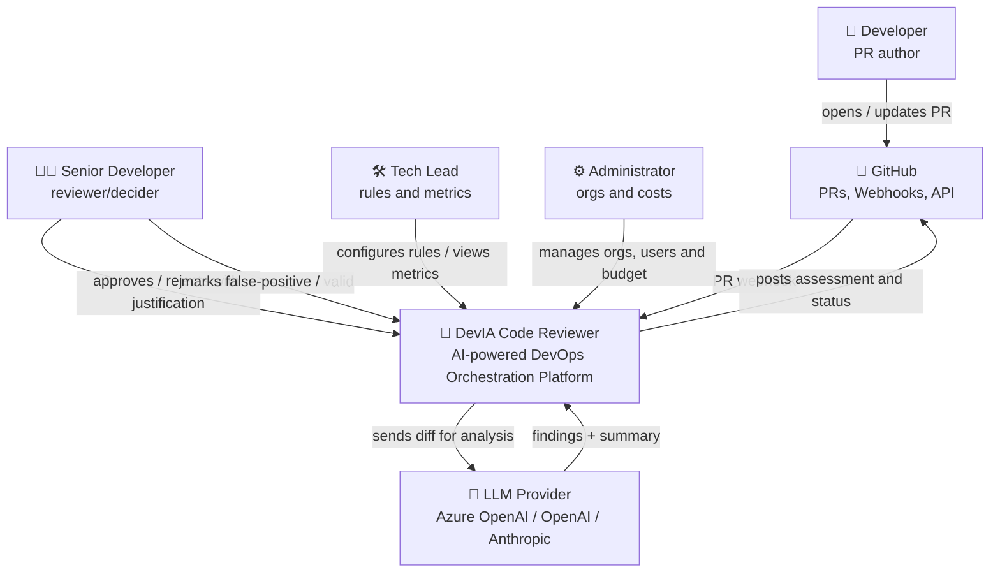

# C4 — Level 1: Context Diagram

Shows the system as a single box, its users, and external systems.

## Actors

| Actor | Description | Goal |
|-------|-------------|------|
| Developer | PR author | Get fast, actionable feedback |
| Senior Developer | Reviewer/decider | Approve/reject based on the AI assessment |
| Tech Lead | Technical manager | Define standards and track quality |
| Administrator | Platform manager | Manage orgs, access, and costs |

## External Systems

| System | Integration |
|--------|-------------|
| GitHub | GitHub App + Webhooks + REST API (diff, comments, status) |
| LLM Provider | Chat/completions API, abstracted by Semantic Kernel |
