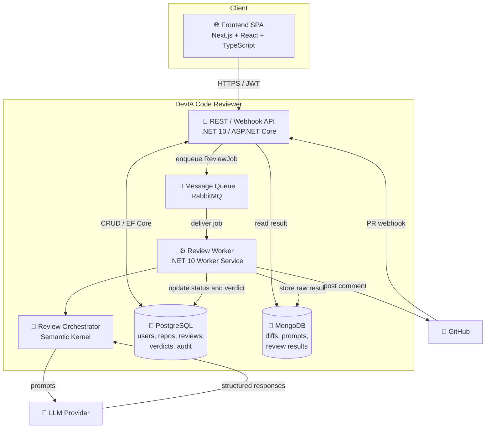

# C4 — Level 2: Container Diagram

Details the applications (containers) that make up the system and their technologies.

## Containers

| Container | Technology | Responsibility | Persistence |
|-----------|-----------|----------------|-------------|
| Frontend SPA | Next.js / React / TS | UI: review queue, assessment, verdict | — |
| API | ASP.NET Core (.NET 10) | REST + webhook; validates, enqueues, serves data | Postgres, Mongo |
| Queue | RabbitMQ | Decouples reception from processing | — |
| Review Worker | .NET Worker | Runs the async review pipeline | Postgres, Mongo |
| Orchestrator | Semantic Kernel | Chains review prompts and plugins | — |
| PostgreSQL | EF Core | Relational, auditable data | — |
| MongoDB | MongoDB.Driver | Large/flexible review documents | — |

## Related decisions

- Hybrid Postgres + Mongo database → [ADR-0003](adr/0003-database-strategy-postgres-mongodb.md)
- Async processing via queue → see [overview](../architecture/overview.md)
