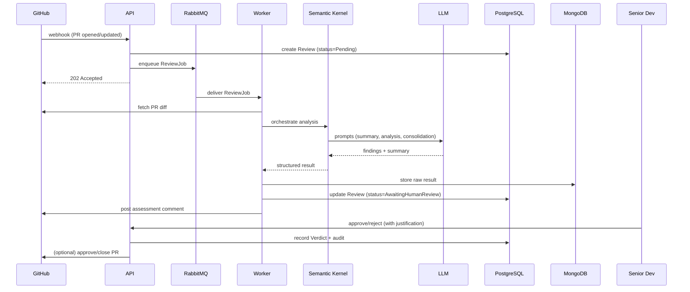
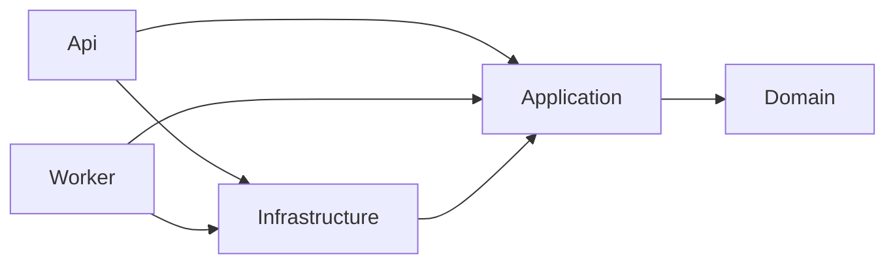

# Architecture Overview

## Principles

1. **Human-in-the-loop:** the AI prepares the assessment; the human decides. The AI never merges.
2. **Async by default:** the LLM review is slow and failure-prone — it never runs on the webhook thread.
3. **Pluggable LLM:** orchestration (Semantic Kernel) abstracts the model provider.
4. **Auditable:** prompt, response, model version, assessment, and verdict are all recorded.
5. **Dependencies point inward:** `Api/Worker` → `Application` → `Domain`; `Infrastructure` implements `Domain` ports.

## Containers (summary)

| Container | Technology | Responsibility |
|-----------|-----------|----------------|
| Frontend | Next.js + React + TS | Review dashboard, GitHub login, verdicts |
| API | .NET 10 / ASP.NET Core | REST + webhook receiver; enqueues jobs |
| Worker | .NET 10 Worker Service | Consumes the queue and runs the review pipeline |
| Orchestrator | Semantic Kernel | Prompt pipeline (summarize → analyze → consolidate) |
| PostgreSQL | EF Core | Relational data and audit trail |
| MongoDB | MongoDB.Driver | Review documents (diff, prompts, findings) |
| RabbitMQ | — | Decouples reception from processing |

See [C4 Level 1](c4-level1-context.md) and [C4 Level 2](c4-level2-container.md).

## Main flow (reviewing a PR)



## Code Structure (Clean Architecture + DDD)

The .NET projects share a single solution (`DevIa.slnx`, .NET 10). `Domain`,
`Application`, and `Infrastructure` are shared libraries consumed by both the `Api`
and the `Worker` composition roots.

```
DevIa.slnx                      # solution (.slnx — .NET 10 XML format)
Directory.Build.props           # shared build settings (net10.0, nullable, implicit usings)

src/
├── DevIa.Domain/               # Entities, aggregates, rules, domain events — no deps
├── DevIa.Application/          # Use cases, DTOs, ports (interfaces) → Domain
├── DevIa.Infrastructure/       # EF Core, Mongo, GitHub client, Semantic Kernel, queue → Application
├── DevIa.Api/                  # Endpoints, webhooks, DI, config → Application + Infrastructure
└── DevIa.Worker/               # Queue consumer + review pipeline → Application + Infrastructure

tests/
├── DevIa.UnitTests/            # Deterministic logic (LLM mocked) → Domain, Application, Infrastructure
└── DevIa.IntegrationTests/     # Webhook → queue → worker → persistence → Api, Worker, Infrastructure

web/                            # Next.js (app router), components, API libs — added in Phase 1

tests/evals/                    # AI quality (golden dataset of PRs) — added with the eval runner
```

**Dependency direction** (inward, per Clean Architecture):



> The solution skeleton exists and compiles (0 warnings). Domain entities, EF Core
> mappings, and feature implementations are added next, guided by the specs.
