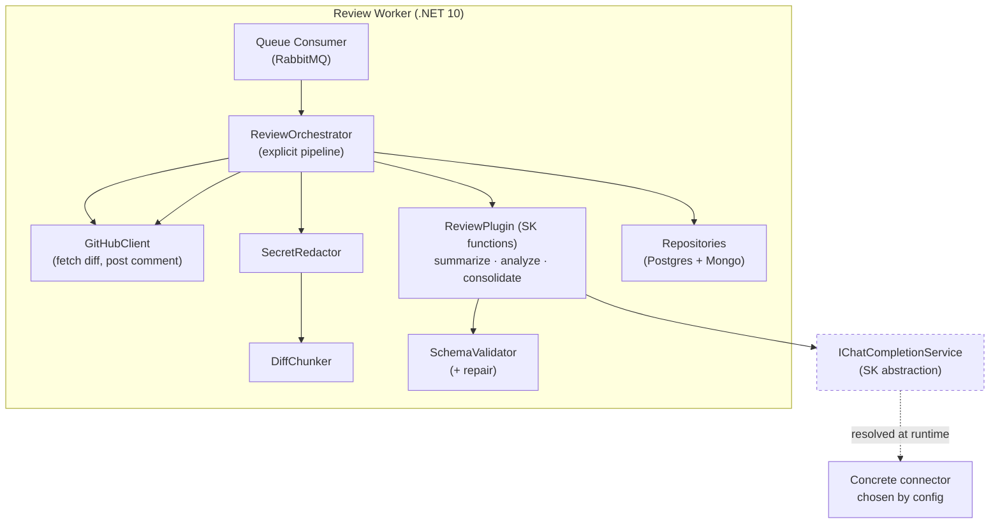
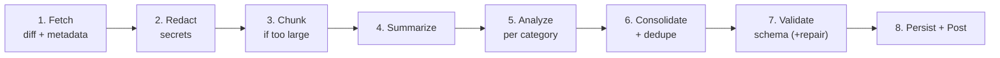

# Review Pipeline (C4 Level 3 — Component)

How the **Review Worker** turns a PR diff into a structured assessment, orchestrated
by **Semantic Kernel**. The design is **provider-agnostic**: the pipeline depends on
SK's `IChatCompletionService` abstraction, never on a concrete LLM connector.

Implements [SPEC-0001](../specs/features/0001-pr-review-pipeline.md).

## Design principles

1. **Explicit orchestration, not auto-planning.** The pipeline is a fixed sequence
   of steps invoked in code — *not* an SK planner deciding steps at runtime. This
   gives determinism, predictable cost, and testability.
2. **Provider-agnostic core.** The orchestrator receives an `IChatCompletionService`
   (and a `Kernel`) by injection. The concrete connector (Azure OpenAI, OpenAI,
   GitHub Models, Ollama, …) is selected in Infrastructure by **configuration only**.
3. **Portable structured output.** Baseline = "ask for JSON + validate + repair".
   When the configured provider supports native JSON-schema/structured output, use
   it as an optimization — but never depend on it.
4. **Safety first.** Secrets are redacted *before* any content leaves for the LLM.
5. **Resilient & accountable.** Transient failures retry with backoff; tokens are
   counted per call for cost tracking.

## Component diagram



## Pipeline stages



| # | Stage | Responsibility | LLM? |
|---|-------|----------------|------|
| 1 | **Fetch** | Pull PR diff + metadata from GitHub | No |
| 2 | **Redact** | Remove secrets/tokens from the diff before sending | No |
| 3 | **Chunk** | If the diff exceeds the token budget, split into coherent chunks (by file/hunk) | No |
| 4 | **Summarize** | Produce the executive summary of the changes (per chunk, then merged) | Yes |
| 5 | **Analyze** | Find issues with severity + category (per chunk) | Yes |
| 6 | **Consolidate** | Merge chunk findings, deduplicate, build the final structured result | Yes/No* |
| 7 | **Validate** | Validate against the JSON schema; repair once if invalid | No |
| 8 | **Persist + Post** | Write Mongo doc → update Postgres → post PR comment | No |

> *Consolidation merges deterministically when possible; an LLM pass is used only to
> dedupe/rank when chunked.

## Semantic Kernel structure

The LLM stages are **prompt functions** grouped in a `ReviewPlugin`. The
`ReviewOrchestrator` invokes them in order — SK provides the function abstraction,
templating, and the provider-agnostic chat service.

```
DevIA.Infrastructure/
└── Ai/
    ├── ReviewOrchestrator.cs        # explicit pipeline (the 8 stages)
    ├── ReviewPlugin/
    │   ├── Summarize.prompt.txt      # stage 4 prompt template
    │   ├── Analyze.prompt.txt        # stage 5 prompt template
    │   └── Consolidate.prompt.txt    # stage 6 prompt template
    ├── SecretRedactor.cs
    ├── DiffChunker.cs
    ├── SchemaValidator.cs
    └── KernelSetup.cs                # ← the ONLY provider-aware file (DI/config)
```

### The single provider-aware seam

Everything stays agnostic except `KernelSetup`, which wires the connector chosen by
config. The orchestrator only ever sees `Kernel` / `IChatCompletionService`.

```csharp
// KernelSetup.cs — the only place that knows about concrete providers.
// Selection is driven by configuration; the pipeline code never changes.
var provider = config["Llm:Provider"];   // "AzureOpenAI" | "OpenAI" | "GitHubModels" | "Ollama"
var builder = Kernel.CreateBuilder();

switch (provider)
{
    case "AzureOpenAI":
        builder.AddAzureOpenAIChatCompletion(deployment, endpoint, apiKey);
        break;
    case "OpenAI":          // also covers GitHub Models / Ollama via OpenAI-compatible endpoint
        builder.AddOpenAIChatCompletion(modelId, apiKey, endpoint: baseUrl);
        break;
    // add Phase 3 providers here — pipeline untouched
}
```

```csharp
// ReviewOrchestrator.cs — 100% provider-agnostic. Unit-testable with a mocked chat service.
public class ReviewOrchestrator(
    IChatCompletionService chat,
    ISecretRedactor redactor,
    IDiffChunker chunker,
    ISchemaValidator validator)
{
    public async Task<ReviewResult> RunAsync(PullRequestDiff input, CancellationToken ct)
    {
        var safeDiff   = redactor.Redact(input.Diff);              // stage 2
        var chunks     = chunker.Split(safeDiff);                  // stage 3
        var summary    = await SummarizeAsync(chunks, ct);         // stage 4
        var findings   = await AnalyzeAsync(chunks, ct);           // stage 5
        var result     = await ConsolidateAsync(summary, findings, ct); // stage 6
        return validator.ValidateAndRepair(result);               // stage 7
    }
}
```

## Prompt templates (provider-agnostic)

Stored as text files, parameterized with SK placeholders (`{{$var}}`). They request
JSON explicitly so the output is portable across providers.

**`Analyze.prompt.txt` (stage 5, abridged):**

```
You are a senior code reviewer. Analyze the following diff and report issues.
Only report real problems; do not invent findings. Be concise.

For each issue, classify:
- severity: Blocker | Major | Minor | Info
- category: Bug | Security | Style | Performance | Test

Return ONLY valid JSON matching this shape (no prose):
{
  "findings": [
    { "title": "", "severity": "", "category": "",
      "file": "", "line": 0, "description": "", "suggestion": "" }
  ]
}

DIFF:
{{$chunk}}
```

> `Summarize` and `Consolidate` follow the same pattern: explicit role, strict "JSON
> only" instruction, and the schema inline. This keeps output portable and validatable.

## Structured output & validation

- **Baseline (portable):** prompt asks for JSON → `SchemaValidator` parses and
  validates against the SPEC-0001 schema → on failure, one **repair** attempt
  ("your output was invalid JSON, return only valid JSON for this schema").
- **Optimization:** if the configured provider supports native structured output,
  request it via SK execution settings — but the validator still runs (defense in depth).

## Large-diff handling (chunking)

- Estimate token size of the redacted diff.
- If under budget → single pass.
- If over budget → split by **file / hunk boundaries** (never mid-line) into chunks
  that fit the model's context, keeping each chunk self-contained.
- Summaries and findings are produced per chunk, then **consolidated** (stage 6),
  which also **deduplicates** repeated findings across chunks.
- Open question (SPEC-0001): exact budget thresholds and overlap strategy.

## Secret redaction (stage 2)

- Runs **before** any LLM call — non-negotiable for compliance.
- Baseline: regex patterns for common secrets (API keys, tokens, connection strings,
  private keys); replace with a placeholder while preserving structure.
- The redacted diff is what gets stored in Mongo too (no raw secrets at rest).
- Open question (SPEC-0001): custom regex vs. a dedicated secret-scanning library.

## Resilience & cost

| Concern | Approach |
|---------|----------|
| Transient LLM errors | Exponential backoff retry around each chat call |
| Hard failure | Review → `Failed`; job reprocessable; no partial PR comment |
| Token accounting | Sum usage per call → `review.tokens_used` (Postgres) + Mongo doc |
| Idempotency | Keyed by (repo, PR, head_sha) upstream (SPEC-0001) |

## Test hooks (ties to SPEC-0001 §10)

- **Unit:** `ReviewOrchestrator` with a **mocked `IChatCompletionService`** — tests
  prompt assembly, chunking, validation, repair, error paths. Zero LLM cost.
- **Eval:** the real pipeline against the **golden dataset** of labeled PRs,
  measuring whether known issues are found (precision/recall, false-positive rate).
```
