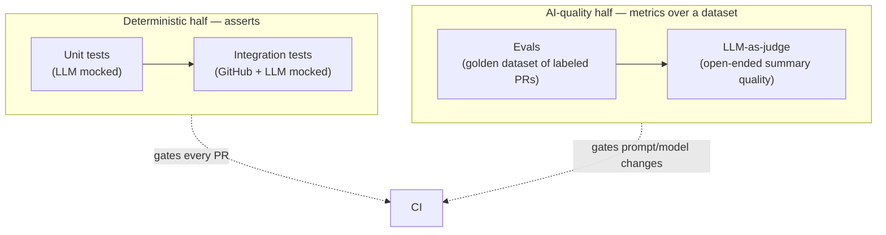

# Testing & Evaluation Strategy

> **Scope — read this first.** This document is about testing **our product** (the
> DevIA Code Reviewer). It is **not** about the tests inside the PR being reviewed.
> The word "test" appears in three distinct places — don't conflate them:
>
> | # | Concept | Whose code | Where |
> |---|---------|-----------|-------|
> | **A** | Our test suite (unit, integration, evals) | DevIA Code Reviewer (us) | this document, `tests/` |
> | **B** | The golden dataset of example PRs | other codebases, used only as **fixtures** to test *us* | [evals section](#layer-3--evals-ai-quality--the-crux) |
> | **C** | "Does the reviewed PR have tests?" | the customer's code | a **product feature** (review rule, category `Test`, Phase 2) — *not* part of our suite |
>
> This document covers **A** (and **B** as input to A). **C** is a product capability,
> documented with its feature spec, not here.

How we test a system whose core output is **non-deterministic** (LLM-generated).
Traditional unit tests are necessary but not sufficient. The strategy has two
distinct halves:

> **Key insight:** separate **deterministic code** (100% unit-testable with a mocked
> LLM) from **AI quality** (measured with *evals* over datasets, not exact asserts).

Implements the test strategy of [SPEC-0001 §10](../specs/features/0001-pr-review-pipeline.md).

## The shape of testing here



## Layer 1 — Unit tests (deterministic)

Test our own logic with the **LLM mocked** (`IChatCompletionService` substitute).
Zero LLM cost, fast, run on every PR.

| Target | Examples |
|--------|----------|
| Prompt assembly | Correct template + placeholders filled |
| Diff chunking | Splits on file/hunk boundaries; never mid-line; respects budget |
| Schema validation | Valid JSON passes; invalid triggers one repair; still-invalid fails cleanly |
| Severity/category mapping | String → enum mapping, unknown values rejected |
| Secret redaction | Known secret patterns removed; structure preserved |
| Idempotency | Same (repo, PR, head_sha) does not create a duplicate review |
| Persistence ordering | Mongo written before Postgres update (resilience invariant) |
| Error paths | LLM error → Review `Failed`, retryable, no partial PR comment |

**Stack:** xUnit + a fake `IChatCompletionService` returning canned responses.

## Layer 2 — Integration tests

Exercise the real wiring end-to-end with **external boundaries mocked** (GitHub API
and LLM). Validates the flow, not the AI quality.

- `webhook → queue → worker → Postgres/Mongo → PR comment`
- GitHub via a stub/WireMock; LLM via the fake chat service.
- Databases via ephemeral containers (Testcontainers for Postgres + Mongo).

## Layer 3 — Evals (AI quality) — the crux

Measure whether the **real pipeline** actually finds the problems. This is *not*
pass/fail on exact text — it's **metrics over a labeled dataset**.

### Golden dataset

A curated set of PRs with **known, labeled defects**.

```
tests/evals/dataset/
├── 0001-null-deref/
│   ├── diff.patch          # the PR diff
│   ├── expected.json       # ground-truth labeled defects
│   └── meta.json           # language, size, tags
├── 0002-sql-injection/
└── ...
```

`expected.json` (ground truth):

```json
{
  "defects": [
    { "file": "src/UserService.cs", "line": 42,
      "category": "Bug", "severity": "Major",
      "description": "Possible null dereference on user" }
  ],
  "shouldHaveFindings": true
}
```

**Curation sources:** real historical bugs, deliberately injected defects, and
"clean" PRs (to measure false positives). Keep it **versioned** and growing — every
production miss/false-positive becomes a new dataset case.

### Metrics

A matcher links each reported finding to a ground-truth defect (same file + nearby
line + compatible category). From that:

| Metric | Definition | Why it matters |
|--------|------------|----------------|
| **Recall** | TP / (TP + FN) | Are we *catching* the real bugs? (most important) |
| **Precision** | TP / (TP + FP) | Are findings *trustworthy* (low noise)? |
| **F1** | harmonic mean | Balance of the two |
| **False-positive rate** | FP on clean PRs | Noise — directly drives reviewer trust |
| **Severity accuracy** | correct severity among matched | Is prioritization right? |

> ⚠️ Precision/FP only make sense if the dataset is **exhaustively labeled** (or uses
> "clean" PRs). Otherwise a valid finding the labels missed counts as a false FP. We
> mitigate with curated clean PRs and reviewer adjudication of new cases.

### LLM-as-judge (open-ended quality)

The executive **summary** has no single right answer. A second LLM scores it against
a rubric (1–5) on: **accuracy**, **completeness**, **conciseness**. Used as a trend
signal, not a hard gate. Guard against bias by using a fixed rubric and, ideally, a
different model as judge.

## Regression: evals as a gate on prompt/model changes

The eval set is a **regression suite for the AI**.

| Trigger | Action |
|---------|--------|
| Change a prompt template | Run full eval set; compare metrics to baseline |
| Change model/provider | Run full eval set; compare cost + metrics |
| New production miss/FP | Add a dataset case first, then fix |

**Gates (example thresholds — tune over time):**

- Recall ≥ baseline − 2pp (no significant regression in catching bugs)
- False-positive rate ≤ target (e.g., ≤ 1 per clean PR)
- Cost per review within budget

Metrics are tracked over time so quality trends are visible, not just pass/fail.

## Cost control for evals

- Evals call a real LLM → they cost money. Run them on **changes that affect AI**
  (prompts/models), not on every commit.
- Use the **cheap provider** for routine eval runs (e.g., `gpt-4o-mini`); reserve
  stronger models for periodic deep runs.
- Cache results per (dataset case, prompt version, model) to avoid re-spending.
- Local dev can run a **subset** (smoke eval) of a few representative cases.

## Where it lives

```
tests/
├── unit/             # xUnit, LLM mocked — runs on every PR (Layer 1)
├── integration/      # Testcontainers + stubs — runs on every PR (Layer 2)
└── evals/
    ├── dataset/      # golden cases (versioned)
    ├── runner/       # executes the pipeline over the dataset, emits metrics
    └── reports/      # metric history (trend tracking)
```

## Summary

| Question | Answered by |
|----------|-------------|
| Does our *code* work? | Layers 1 & 2 (deterministic, every PR) |
| Does the *AI* find real bugs? | Layer 3 evals (recall/precision over dataset) |
| Is the *summary* good? | LLM-as-judge (trend) |
| Did a prompt/model change make it worse? | Eval regression gate |
