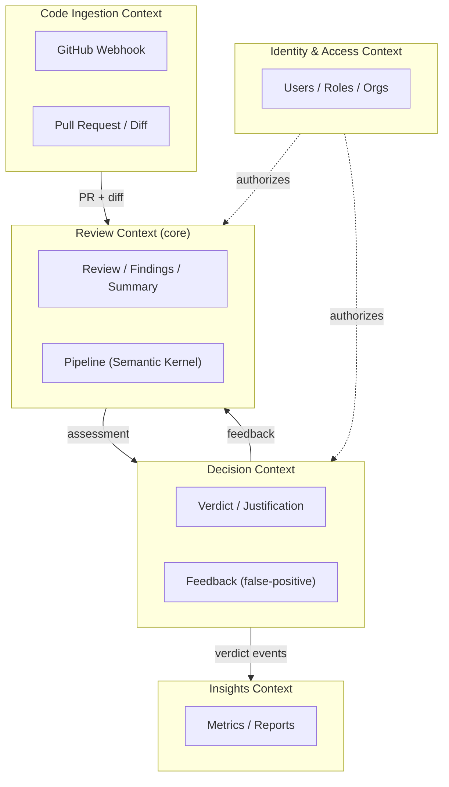

# Bounded Contexts (DDD)

The domain is divided into contexts with clear boundaries. Each context has its own
model and vocabulary; integration between them is explicit.

## Contexts

| Context | Responsibility | Core? |
|---------|----------------|-------|
| **Code Ingestion** | Receive webhooks, fetch PR diff/metadata from GitHub | Supporting |
| **Review** | Orchestrate the AI pipeline, produce summary and findings | 🟢 **Core domain** |
| **Decision** | Record human verdict and feedback; reflect it on GitHub | 🟢 **Core domain** |
| **Identity & Access** | Authentication (GitHub OAuth), roles, organizations (RBAC) | Generic |
| **Insights** | Metrics, trends, and quality reports | Supporting |

## Mapping to code

Each context tends to become a module/namespace within the `Domain` and
`Application` layers. In the MVP, supporting contexts can be simplified; the
modeling investment concentrates on the **core** (Review + Decision).

> The product's **competitive edge** is in the core (Review + Decision):
> assessment quality and the *human-in-the-loop* flow with learning.
