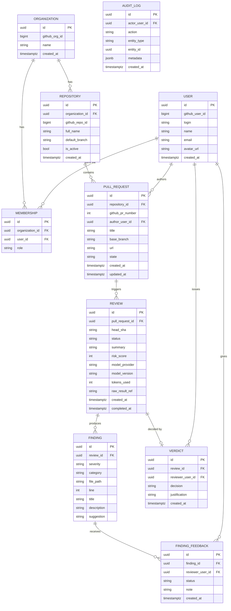
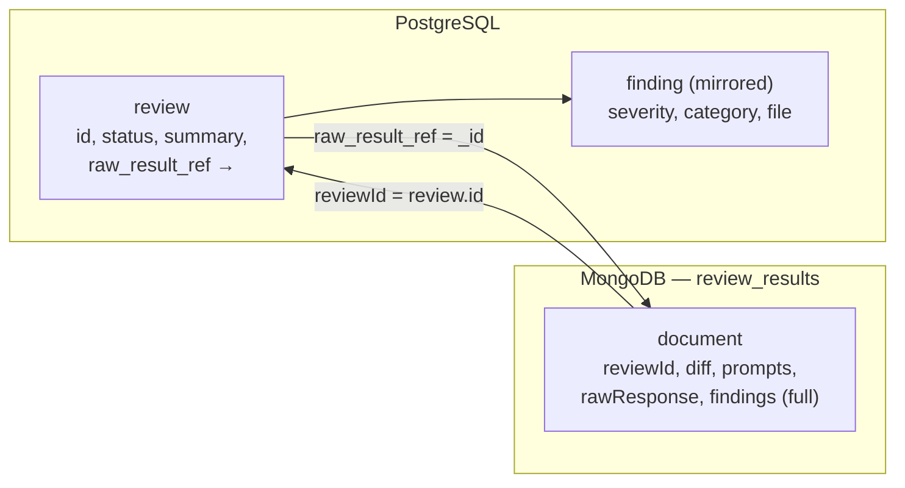

# Data Model

Defines the persistence model for the platform. Following the polyglot strategy in
[ADR-0003](../architecture/adr/0003-database-strategy-postgres-mongodb.md):
**PostgreSQL** holds relational, queryable, auditable data; **MongoDB** holds the
large, variable-schema raw review content.

> This document is the **blueprint**; the C# entities (Domain layer) and EF Core
> mappings are implemented in Phase 1 from the definitions below.

## Principles

1. **Metadata in Postgres, raw content in Mongo.** A `Review` keeps its lifecycle
   metadata in Postgres and links to a `ReviewResult` document in Mongo.
2. **Findings are mirrored.** Findings live in full inside the Mongo document, and
   are mirrored as rows in Postgres (severity, category, file) to enable metrics
   and dashboards without reprocessing Mongo.
3. **Model provider is generic.** `Review` stores `ModelProvider` / `ModelVersion`
   as plain fields — no coupling to a specific LLM (supports the Phase 3 multi-LLM).
4. **Append-only audit.** Every state-changing action writes to `AuditLog`.

## Entity-Relationship Diagram (PostgreSQL)



## PostgreSQL Tables

| Table | Context | Purpose | Phase |
|-------|---------|---------|-------|
| `organization` | Identity & Access | GitHub org connected to the platform | MVP |
| `user` | Identity & Access | A GitHub user (author or reviewer) | MVP |
| `membership` | Identity & Access | User ↔ org link with a role (RBAC) | MVP* |
| `repository` | Identity & Access | A connected repository | MVP |
| `pull_request` | Code Ingestion | A PR; may have many reviews over time | MVP |
| `review` | Review | Review lifecycle metadata + link to Mongo | MVP |
| `finding` | Review | Mirrored finding metadata (for metrics) | MVP |
| `verdict` | Decision | Human decision on a review | MVP |
| `finding_feedback` | Decision | Reviewer marks a finding valid/false-positive | Phase 2 |
| `audit_log` | cross-cutting | Append-only trail of state changes | MVP |

> *MVP can use a simplified `role` model; full RBAC matures in Phase 2.

### Notes on key tables

- **`review.status`** is the denormalized lifecycle state (see enums). When a
  `verdict` is recorded, `review.status` becomes `Approved`/`Rejected`, while the
  `verdict` row holds the detail (who, when, justification).
- **`review.raw_result_ref`** stores the MongoDB document `_id` linking to the full
  `ReviewResult`.
- **`review.summary`** keeps the short executive summary (queried often); the full
  raw model output lives in Mongo.
- **Idempotency:** a unique constraint on (`pull_request_id`, `head_sha`) prevents
  duplicate reviews for the same PR version.

## MongoDB Document Model

Collection: **`review_results`** — one document per `Review`, holding the raw,
high-volume content.

```json
{
  "_id": "ObjectId",
  "reviewId": "uuid (links to postgres review.id)",
  "pullRequest": {
    "repositoryFullName": "org/repo",
    "number": 123,
    "headSha": "abc123",
    "baseBranch": "main"
  },
  "diff": "the unified diff sent for analysis (post secret-redaction)",
  "prompts": [
    { "step": "summarize", "model": "gpt-4o-mini", "content": "..." },
    { "step": "analyze",   "model": "gpt-4o-mini", "content": "..." },
    { "step": "consolidate","model": "gpt-4o-mini", "content": "..." }
  ],
  "rawResponse": "the raw, unparsed model output (JSON text) of the final attempt",
  "findings": [
    {
      "title": "...",
      "severity": "Major",
      "category": "Bug",
      "file": "src/Foo.cs",
      "line": 42,
      "description": "...",
      "suggestion": "..."
    }
  ],
  "tokensUsed": 5321,
  "modelProvider": "AzureOpenAI",
  "modelVersion": "gpt-4o-mini",
  "createdAt": "2026-06-01T12:00:00Z"
}
```

### Postgres ↔ Mongo linking



> No distributed transaction spans the two stores (per ADR-0003). The Worker writes
> the Mongo document **first**, then updates the Postgres `review` (status +
> `raw_result_ref`) and inserts mirrored `finding` rows — so an interrupted run
> never points Postgres at a missing document.

## Enums

| Enum | Values |
|------|--------|
| `ReviewStatus` | `Pending`, `Processing`, `AwaitingHumanReview`, `Approved`, `Rejected`, `Failed` |
| `Severity` | `Blocker`, `Major`, `Minor`, `Info` |
| `FindingCategory` | `Bug`, `Security`, `Style`, `Performance`, `Test` |
| `VerdictDecision` | `Approved`, `Rejected` |
| `MembershipRole` | `Developer`, `Reviewer`, `TechLead`, `Admin` |
| `FeedbackStatus` | `Valid`, `FalsePositive` |

## C# Domain Entities (blueprint for Phase 1)

Reference shapes for the `DevIA.Domain` layer. Not yet compiled — created with the
solution in Phase 1.

```csharp
// --- Identity & Access ---
public class Organization
{
    public Guid Id { get; private set; }
    public long GithubOrgId { get; private set; }
    public string Name { get; private set; }
    public DateTimeOffset CreatedAt { get; private set; }
    public ICollection<CodeRepository> Repositories { get; private set; } = [];
}

public class User
{
    public Guid Id { get; private set; }
    public long GithubUserId { get; private set; }
    public string Login { get; private set; }
    public string? Name { get; private set; }
    public string? Email { get; private set; }
    public string? AvatarUrl { get; private set; }
    public DateTimeOffset CreatedAt { get; private set; }
}

// Entity name is CodeRepository to avoid clashing with the persistence Repository
// pattern. The physical table remains "repository".
public class CodeRepository
{
    public Guid Id { get; private set; }
    public Guid OrganizationId { get; private set; }
    public long GithubRepoId { get; private set; }
    public string FullName { get; private set; }   // "org/repo"
    public string DefaultBranch { get; private set; }
    public bool IsActive { get; private set; }
    public DateTimeOffset CreatedAt { get; private set; }
}

// --- Code Ingestion ---
public class PullRequest
{
    public Guid Id { get; private set; }
    public Guid RepositoryId { get; private set; }
    public int GithubPrNumber { get; private set; }
    public Guid AuthorUserId { get; private set; }
    public string Title { get; private set; }
    public string BaseBranch { get; private set; }
    public string Url { get; private set; }
    public string State { get; private set; }
    public DateTimeOffset CreatedAt { get; private set; }
    public DateTimeOffset UpdatedAt { get; private set; }
    public ICollection<Review> Reviews { get; private set; } = [];
}

// --- Review (core) ---
public class Review
{
    public Guid Id { get; private set; }
    public Guid PullRequestId { get; private set; }
    public string HeadSha { get; private set; }
    public ReviewStatus Status { get; private set; }
    public string? Summary { get; private set; }
    public int? RiskScore { get; private set; }
    public string? ModelProvider { get; private set; }
    public string? ModelVersion { get; private set; }
    public int? TokensUsed { get; private set; }
    public string? RawResultRef { get; private set; }   // Mongo _id
    public DateTimeOffset CreatedAt { get; private set; }
    public DateTimeOffset? CompletedAt { get; private set; }
    public ICollection<Finding> Findings { get; private set; } = [];
    public Verdict? Verdict { get; private set; }
}

public class Finding
{
    public Guid Id { get; private set; }
    public Guid ReviewId { get; private set; }
    public Severity Severity { get; private set; }
    public FindingCategory Category { get; private set; }
    public string FilePath { get; private set; }
    public int? Line { get; private set; }
    public string Title { get; private set; }
    public string Description { get; private set; }
    public string? Suggestion { get; private set; }
}

// --- Decision (core) ---
public class Verdict
{
    public Guid Id { get; private set; }
    public Guid ReviewId { get; private set; }
    public Guid ReviewerUserId { get; private set; }
    public VerdictDecision Decision { get; private set; }
    public string? Justification { get; private set; }
    public DateTimeOffset CreatedAt { get; private set; }
}
```

## Open Questions

- Do we need soft-delete (e.g., disconnecting a repository) or is `is_active` enough?
- Retention policy for Mongo `review_results` (diffs can be large over time)?
- Should `risk_score` be computed and stored, or derived on read in the MVP?
