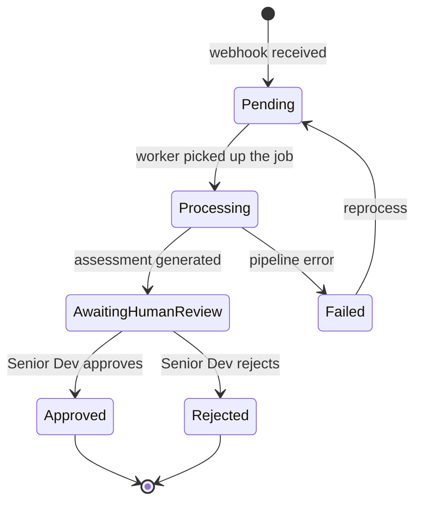

# Ubiquitous Language

The shared vocabulary of the domain. Everyone — code, specs, conversations, UI —
uses these terms with **the same meaning**. This avoids ambiguity between the team
and the AI.

| Term | Definition |
|------|------------|
| **Pull Request (PR)** | A merge request on GitHub that triggers a review. |
| **Review** | The process (and its result) of automated AI analysis of a PR. |
| **Finding** | An individual item identified in the review (bug, security, style, etc.), with a severity. |
| **Severity** | Criticality classification of a finding: `Blocker`, `Major`, `Minor`, `Info`. |
| **Summary** | A concise description of what the PR changed and its impact. |
| **Assessment** | The package delivered to the human: summary + list of findings. |
| **Verdict** | The Senior Developer's final decision on the PR: `Approved` or `Rejected`, with justification. |
| **Reviewer** | The Senior Developer responsible for issuing the verdict. |
| **Author** | The developer who opened the PR. |
| **False-positive** | A finding the reviewer marks as invalid (feeds the learning loop). |
| **Gate / Rule** | A configurable criterion that affects the review (e.g., require tests, minimum severity). |
| **Review Pipeline** | The orchestrated sequence of steps that produces the assessment (summarize → analyze → consolidate). |
| **Risk Score** | An indicator of PR risk (size, sensitive areas, test coverage). |
| **Review Job** | A unit of work queued for the Worker to process a PR. |

## Review states

