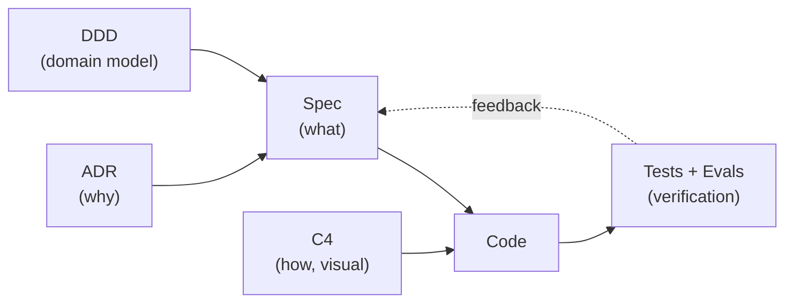

# Development Methodology

This project adopts a **hybrid** centered on **Spec-Driven Development (SDD)**,
supported by three complementary practices. Each one solves a specific problem.

## Overview

| Practice | Role | Solves |
|----------|------|--------|
| **Spec-Driven Development** | Backbone | *What* to build — a contract readable by humans and AI |
| **Domain-Driven Design** | Modeling | Organizing the domain into *bounded contexts* |
| **C4 Model** | Diagrams | Visual communication of the architecture in levels |
| **ADR** | Decisions | *Why* each choice was made (team memory) |

## 1. Spec-Driven Development (SDD)

Every feature starts as a **spec** before it becomes code. The spec describes the
expected behavior, acceptance criteria, and scenarios — and serves as **durable
context** for AI-assisted development.

**Flow:**

```
Specify  →  Plan  →  Implement  →  Verify against the spec
(spec.md)   (design)  (code)        (tests + evals)
```

- Specs live in [`specs/features/`](specs/features/), numbered and versioned.
- Always use the [template](specs/templates/feature-spec-template.md).
- The spec is the **source of truth**: a mismatch between code and spec is a bug (in one or the other).

> **Why SDD here?** The product is built with AI agents. The spec reduces
> ambiguity, gives the agent context, and makes the result auditable.

## 2. Domain-Driven Design (DDD)

We use DDD **lightly, both tactical and strategic**:

- **Ubiquitous Language:** a single vocabulary, in [domain/ubiquitous-language.md](domain/ubiquitous-language.md).
- **Bounded Contexts:** clear boundaries, in [domain/bounded-contexts.md](domain/bounded-contexts.md).
- **Layers:** `Domain` → `Application` → `Infrastructure` → `Api` (dependencies point inward).

We don't aim for "purist" DDD — we adopt what adds clarity without ceremony.

## 3. C4 Model

We document the architecture in levels (only the ones we need):

- **Level 1 — Context:** system + actors + external systems.
- **Level 2 — Container:** applications and technologies.
- **Level 3 — Component:** created on demand, per context, when useful.

Diagrams in [Mermaid](https://mermaid.js.org/) (versionable as text).

## 4. ADR — Architecture Decision Records

Each relevant architectural decision becomes a short file in
[architecture/adr/](architecture/adr/). Format: context → decision → consequences.
Decisions are never deleted; they are **superseded** (status `Superseded`).

## How the practices fit together


